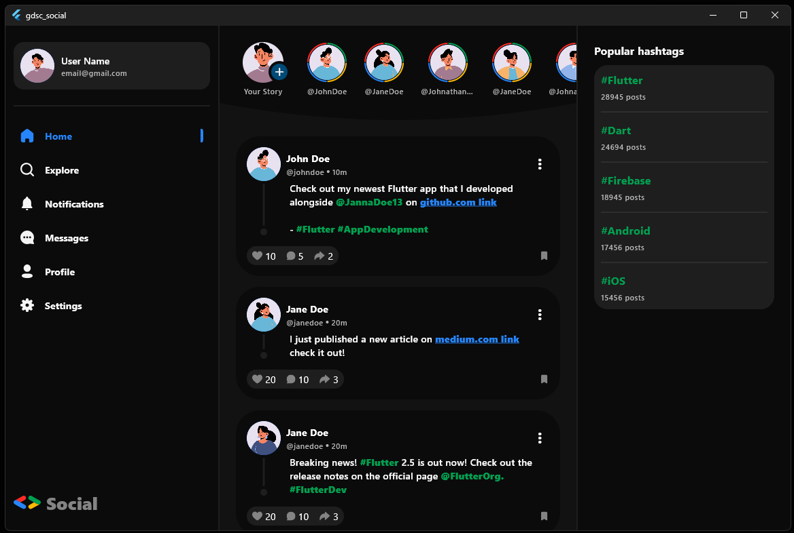
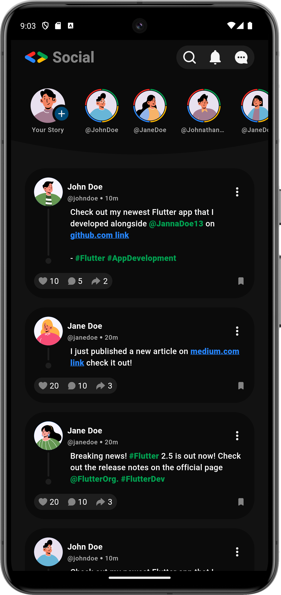
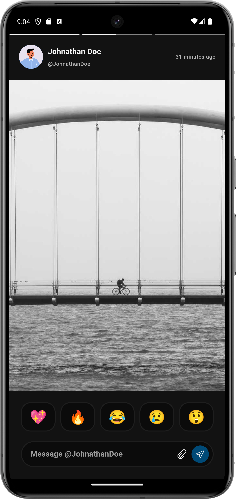
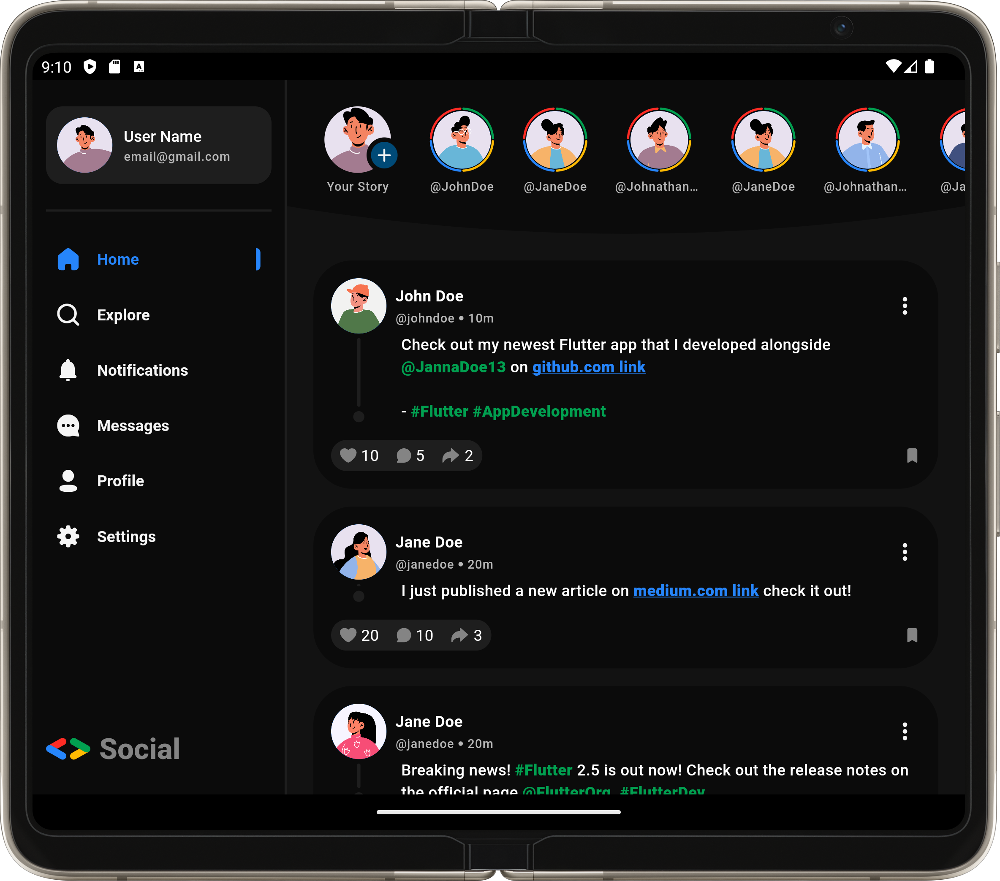
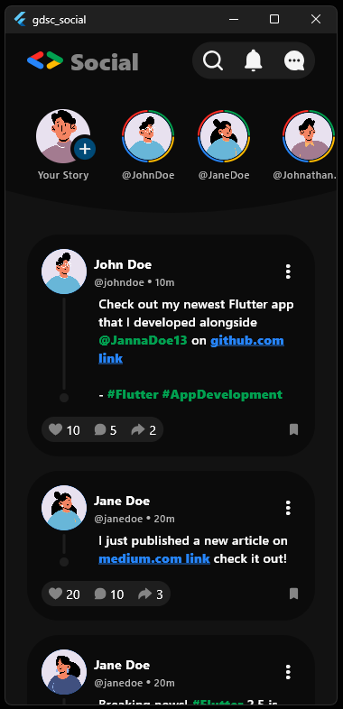
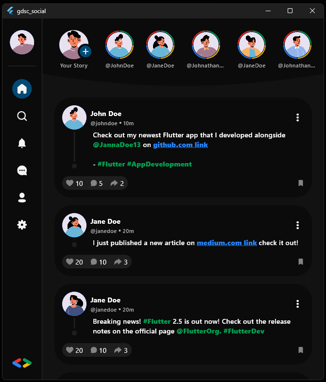
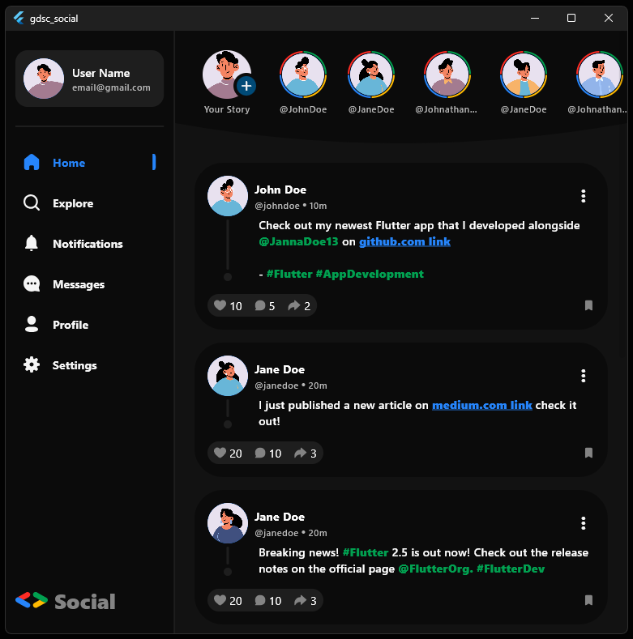

# Project Title: GDSC Social



## Table of Contents
- [Info](#info)
- [Installing](#installing)
- [App Screenshots](#usage)

## Info
Brief project description 2-3 sentences.
This project is a simple social media app, designed specifically for my course at GDSC ASU. The app allows users to create posts, view other users' posts, and interact with them. The app also includes a chat feature that allows users to chat with each other.

## Installing
1. Clone the repository
2. Run `flutter pub get` to install dependencies
3. Run `flutter run` to start the application

```bash
git clone
flutter pub get
flutter run
```

## App Screenshots
### PHONE
<p align="center">
  
  
</p>

### TABLET


### DESKTOP
<p align="center">
  
  
</p>
<div></div>

